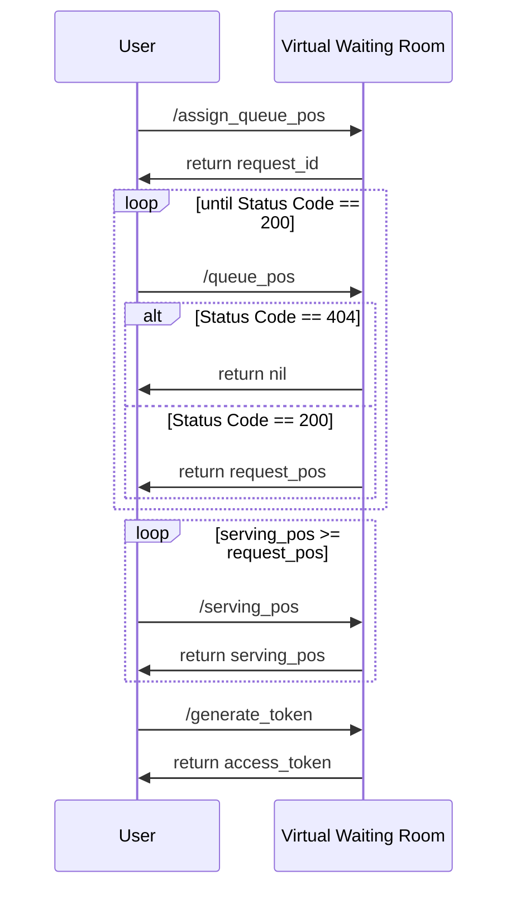

# Virtual Waiting Room

## 简述
虚拟等候室可以在流量激增的情况下控制流入网站的流量，保护网站不被突发流量击垮。
虚拟等候室充当排队队列，当网站容纳人数达到上限时，用户需要排队进入网站。虚拟等候室会为用户生成访问凭证，持有凭证的用户才准许访问网站。

虚拟等候室可以在以下情况下使用：
* 销售音乐会或体育赛事门票
* 减价销售或其他大型零售销售
* 在线下订单或在线付款

## 虚拟等候室流程

1. 用户进入网站，客户端（浏览器、移动设备）调用 /assign_queue_pos 获得 request_id，这是一个异步请求会立马返回一个 request_id。
2. 客户端获得 request_id 后就可以轮询 /queue_pos，当 request_id 被虚拟等候室成功处理后会返回 request_pos。
3. 客户端获得 request_pos 后就可以轮询 /serving_pos，虚拟等候室会返回当前服务位置 serving_pos，当 serving_pos 大于等于 request_pos 时
  客户端可以访问 /generate_token 获得访问令牌。
  

## Public APIs

### /assign_queue_pos
进入等候室队列。这是一个异步请求，会立马返回一个 request_id。后续需要轮询 /queue_pos 查看该 request_id 是否已被处理。
* Path: /assign_queue_pos
* Method: post
* Content-type: application/x-www-form-urlencoded
* Query: none
* Request body
  * queue_id
* Response body
  * request_id
* Status codes
  * 200: 成功
  * 400: 无效参数

### /queue_pos/{queue_id}/{request_id}
查看 request_id 是否已被处理，并返回其在等候室队列里的位置 request_pos。
* Path: /queue_pos/{queue_id}/{request_id}
* Method: get
* Content-type: application/json
* Query
  * queue_id
  * request_id
* Request body 
  * position
* Response body:
  * position
* Status codes
  * 200: 成功
  * 400: 无效参数
  * 404: request_id 还未被处理
  * 410: request_id 已过期

### /serving_pos/{queue_id}
查看等候室当前服务的队列位置。当 serving_pos 大于或等于 request_pos 时，客户端可以请求 /generate_token 获取访问凭证。
* Path: /serving_pos/{queue_id}
* Method: get
* Content-type: application/json
* Query
  * queue_id
* Request body: none
* Response body
  * position
* Status codes
  * 200: 成功
  * 400: 无效参数

### /waiting_num/{queue_id}
查看虚拟等候室排队人数，包括 request_pos > serving_pos 和 request_pos <= serving_pos 但还未进入网站的用户。
* Path: /waiting_num/{queue_id}
* Method: get
* Content-type: application/json
* Query
    * queue_id
* Request body: none
* Response body
  * waiting_num
* Status codes
  * 200: 成功
  * 400: 无效参数

### /generate_token
生成访问令牌，只有持有访问令牌的请求才能访问网站。
* Path: /generate_token
* Method: post
* Content-type: application/x-www-form-urlencoded
* Query: none
* Request body
  * queue_id
  * request_id
* Response body
  * access_token
  * token_type
  * expires_in
* Status codes
  * 200: 成功
  * 202: 请求排队中，request_id 还未能得到服务
  * 400: 无效参数
  * 410: request_id 已过期

## Private APIs

### /api/queue
添加虚拟等候室。
* Path: /api/queue
* Method: post
* Content-type: application/json
* Query: none
* Request body:
  * queue_id
  * token_validity_second
  * enable_queue_position_expiry
  * position_expiry_second
* Response body:
  * id
  * queue_id
  * token_validity_second
  * enable_queue_position_expiry
  * position_expiry_second
* Status codes:
  * 200: 成功
  * 500: 失败

### /api/queue
更新虚拟等候室信息。
* Path: /api/queue
* Method: put
* Content-type: application/json
* Query: none
* Request body:
  * id
  * queue_id
  * token_validity_second
  * enable_queue_position_expiry
  * position_expiry_second
* Response body:
  * id
  * queue_id
  * token_validity_second
  * enable_queue_position_expiry
  * position_expiry_second
* Status codes:
  * 200: 成功
  * 500: 失败

### /api/queue/{id}
获取虚拟等候室信息。
* Path: /api/queue/{id}
* Method: get
* Content-type: application/json
* Query: 
  * id
* Request body: none
* Response body:
  * id
  * queue_id
  * token_validity_second
  * enable_queue_position_expiry
  * position_expiry_second
* Status codes:
  * 200: 成功
  * 404: 虚拟等候室不存在
  * 500: 失败

### /api/queue/{id}
删除虚拟等候室。
* Path: /api/queue/{id}
* Method: delete
* Content-type: application/json
* Query:
  * id
* Request body: none
* Response body: none
* Status codes
  * 200: 成功
  * 404: 虚拟等候室不存在
  * 500: 失败

### /api/queue/increment_serving_position
递增虚拟等候室可获得服务的队列位置。
* Path: /api/queue/increment_serving_position
* Method: post
* Content-type: application/x-www-form-urlencoded
* Query: none
* Request body:
  * queue_id
  * increment_by
* Response body:
  * serving_pos
* Status codes
  * 200: 成功
  * 400: 无效参数
  * 500: 失败

### /api/queue/update_token_status
更改访问令牌的状态。
* Path: /api/queue/update_token_status
* Method: post
* Content-type: application/x-www-form-urlencoded
* Query: none
* Request body:
  * queue_id
  * request_id
  * status: 1, COMPLETED; 2, ABANDONED 
* Response body: none
* Status codes
  * 200: 成功
  * 400: 无效参数

### /api/queue/{queue_id}/active_token_num
更改访问令牌的状态。
* Path: /api/queue/{queue_id}/active_token_num
* Method: get
* Content-type: application/json
* Query:
  * queue_id
* Request body: none
* Response body: 
  * active_num
* Status codes
  * 200: 成功
  * 400: 无效参数

## 参考

* [AWS 虚拟等候室](https://aws.amazon.com/cn/solutions/implementations/virtual-waiting-room-on-aws/ )。